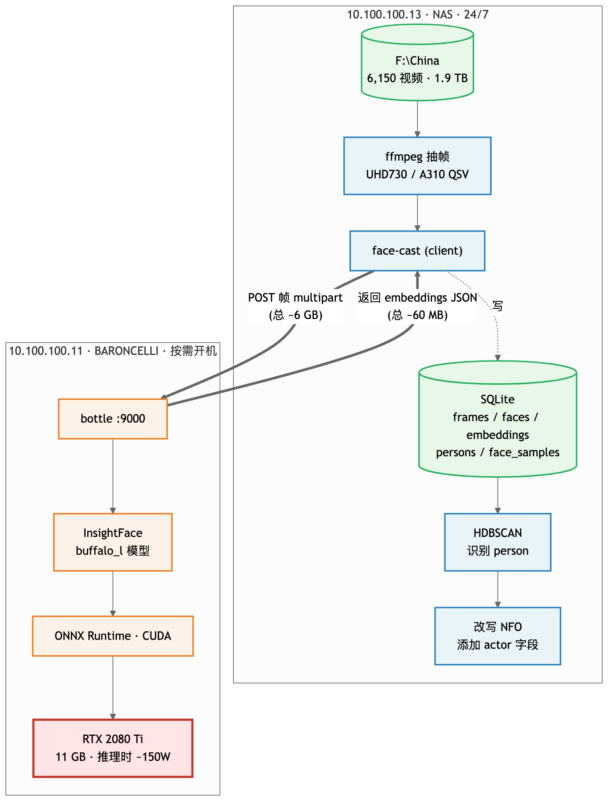

# face-cast

> 给媒体库自动建立 cast（演员阵容）—— 抽帧 → 人脸推理 → person 识别 → 写 NFO

把一个媒体库（比如 6,000+ 视频）按「同一个人」自动归类，给每个视频的 NFO 写入 `<actor>` 字段，喂 Jellyfin / Kodi 当演员维度索引。

不做「识别这是谁」（没有先验人脸库），只做**匿名 person 识别**：person_0、person_1、… 后期由用户给 person 命名（"演员A"、真名等）。

## 架构



**两台机分工**：

- **服务端**（GPU 机器）：bottle + waitress 暴露 HTTP，跑 InsightFace `buffalo_l`，输入图片→返回 bbox + 512 维 embedding。**无状态**，不存任何东西。
- **客户端**（NAS / 编排机）：用 ffmpeg 抽帧 → POST 给服务端 → embedding 存进本地 SQLite → HDBSCAN 识别 person → 改写 NFO。

## Schema 亮点

[`schema.sql`](schema.sql) 共 8 张表：

```
frames           视频路径 + 时间戳 → 唯一标识一帧位置
  ↓ 1:N
faces            检测到的脸 (含 bbox + 缓存的 224x224 jpg crop)
  ↓ 1:N (按 model)
embeddings       每张脸 × 每个模型 = 一条向量 (历史快照, 多模型并存)

detection_runs   每次跑 HDBSCAN = 一次 run (可对比不同模型/参数)
  ↓ 1:N
persons          run 内识别出的"人" (匿名 ID + 可选 display_name)
  ↓ N:M
face_samples     "这张脸是这个 person 的一个样本"
```

**多模型友好**：升级 buffalo_l → buffalo_2026 时不丢老数据，并存。
**face crop 缓存**：升级模型不用重抽视频，直接喂老 crop 重 embed（30k 张缓存约 1 GB）。
**run 历史**：可对比新老模型识别结果。

## 快速开始

### 服务端（GPU 机器，Win/Linux/Mac）

```powershell
# Windows: 一键脚本
powershell -ExecutionPolicy Bypass -File server/install-server.ps1
# 启动
cd F:\face-server
uv run face-server --host 0.0.0.0 --port 9000
```

```bash
# Linux/Mac
git clone https://github.com/naughtyGitCat/face-cast
cd face-cast
uv sync --extra server
uv run face-server --host 0.0.0.0 --port 9000
```

模型 `buffalo_l` 首次启动自动下载（~280 MB）。

### 客户端（NAS / 编排机）

```bash
git clone https://github.com/naughtyGitCat/face-cast
cd face-cast
uv sync   # 不带 --extra server, 装的是客户端依赖
```

要装 ffmpeg/ffprobe 在 PATH 里。

```bash
# 1. 探活
uv run face-cast health -s http://10.100.100.11:9000

# 2. 端到端跑
uv run face-cast run /path/to/media \
    --server http://10.100.100.11:9000 \
    --db ./cast.db \
    --frames 5

# 3. 看识别结果 (谁出场最多?)
uv run face-cast list-persons

# 4. 给某个 person 起人类名
uv run face-cast name-person 7 '李雅'

# 5. 重写 NFO (改名后)
uv run face-cast write-nfo

# 6. 导出代表头像 (写 .actors/<名>.jpg 到视频目录)
uv run face-cast export-portraits
```

## CLI 子命令

| 命令 | 用途 |
|---|---|
| `health` | 探活 + 看 server 模型信息 |
| `run` | 端到端: scan + extract + embed + detect + write-nfo |
| `extract` | 只跑抽帧 + embedding (不识别) |
| `detect` | 只跑 HDBSCAN 识别 (DB 已有 embedding 时) |
| `write-nfo` | 只重写 NFO (识别已完成 / 用户改名后) |
| `list-persons` | 列出当前 active run 的所有 person |
| `name-person` | 给某个 person_idx 起人类名 |
| `export-portraits` | 给每个 person 选代表头像, 写 `.actors/<名>.jpg` |
| `stats` | 整体统计 |

## 服务端 API

`GET /health`

```json
{"ok": true, "model_name": "buffalo_l", "providers": ["CUDAExecutionProvider"]}
```

`GET /model/info`

```json
{
  "model_name": "buffalo_l",
  "model_version": "2024.01.15-onnx",
  "detector": "retinaface_buffalo_l",
  "embedding_dim": 512,
  "det_size": [640, 640]
}
```

`POST /detect` — multipart `file=<jpg/png>`

```json
{
  "model_name": "buffalo_l",
  "model_version": "2024.01.15-onnx",
  "image_shape": [1280, 720],
  "faces": [
    {
      "bbox": [120, 100, 280, 320],
      "kps": [[x,y], [x,y], [x,y], [x,y], [x,y]],
      "embedding": [0.12, -0.34, ...],
      "det_score": 0.99,
      "age": 28,
      "sex": 0
    }
  ],
  "took_ms": 21
}
```

`POST /detect_batch` — multipart `files=[<jpg>, <jpg>, ...]`，推荐 8-16 张/批。

## 性能预期 (RTX 2080 Ti + i3-12300T NAS)

| 阶段 | 时间 |
|---|---|
| 抽帧 (UHD730 / A310 QSV) | ~10 分钟 (6,150 视频 × 5 帧) |
| 推理 (2080 Ti, buffalo_l) | ~10 分钟 (30,000 帧) |
| HDBSCAN 识别 person | ~2 分钟 (CPU) |
| 写 NFO | ~5 分钟 |
| **端到端** | **~30-45 分钟** |

## 演员头像如何流到 Jellyfin

`export-portraits` 流程：

1. **挑代表 face**：每个 person 算 `det_score × cosine_sim_to_centroid`，分最高的那张 face 当头像
2. **写到 `.actors/`**：把 `faces.crop_jpeg` (224×224 缓存) 写为 `<视频目录>/.actors/<display_name>.jpg`
3. **Jellyfin 自动发现**：扫到 NFO 里 `<actor><name>李雅</name></actor>` 时，会查同目录 `.actors/李雅.jpg`，找到就当头像
4. **全局缓存**：Jellyfin 看到第一份后**全库共享**这个 actor 的头像

不需要改 NFO 的 `<actor>` 块加 `<thumb>` —— Jellyfin 的 `.actors/` 自动发现机制比 inline 路径更省事。

```bash
uv run face-cast export-portraits           # 只导命名过的 person (推荐)
uv run face-cast export-portraits --include-unnamed   # 把未命名的也导
uv run face-cast export-portraits --dry-run           # 只看不写
uv run face-cast export-portraits --no-redundant      # 每 person 只在 1 个目录放
```

## 升级模型

新模型 `buffalo_2026` 来了：

```bash
# 1. 服务端切换 (改 install-server.ps1 或环境变量)
FACE_MODEL_NAME=buffalo_2026 uv run face-server

# 2. 客户端: 只对老 face crop 重 embed (不用重抽视频, 几分钟)
# (TODO: 此命令尚未在 cli 实现, 直接调用 phase2 模块或写脚本)

# 3. 用新 embedding 重新识别
uv run face-cast detect

# 4. 给新 person 起名 + 重写 NFO
```

## 设计取舍 / FAQ

**为什么不用 CompreFace / DeepFace / face_recognition?**
- CompreFace 适合「持续识别已知人脸库」，我们要的是「批量识别未知人」
- DeepFace 抽象层多，最终最强还是 ArcFace = InsightFace 的核心
- face_recognition 用的是 dlib 老模型 (2017)，亚洲面孔差，CUDA 装起来痛苦

**为什么 server 不存 embedding？**
- 隐私：图片发完即灭
- 简洁：服务端是纯函数，客户端管所有状态
- 多客户端复用：同一服务可服务多个 NAS

**为什么用 SQLite 而不是 vector DB？**
- 30k 量级 embedding 矩阵 ~60 MB，全在内存里 numpy 算 KNN <10ms
- 不引入 PG/Milvus 这类重组件
- 真到 100k+ 再加 [sqlite-vec](https://github.com/asg017/sqlite-vec) 扩展，schema 不变

**为什么 bottle 不用 FastAPI？**
- 4 个端点，不需要 Pydantic / 自动 OpenAPI / async
- bottle 单文件零依赖，启动快 10x，依赖少 50 MB
- GPU 推理本质串行，async 没收益

**person 是什么意思？**
- 一组 HDBSCAN 自动判定为「同一人」的脸样本集合
- 初始匿名 (`person_0`, `person_1`, …)，用户后期手动命名重要的几个
- 等价于 NFO 里的 `<actor>` 字段

## 协议

MIT
